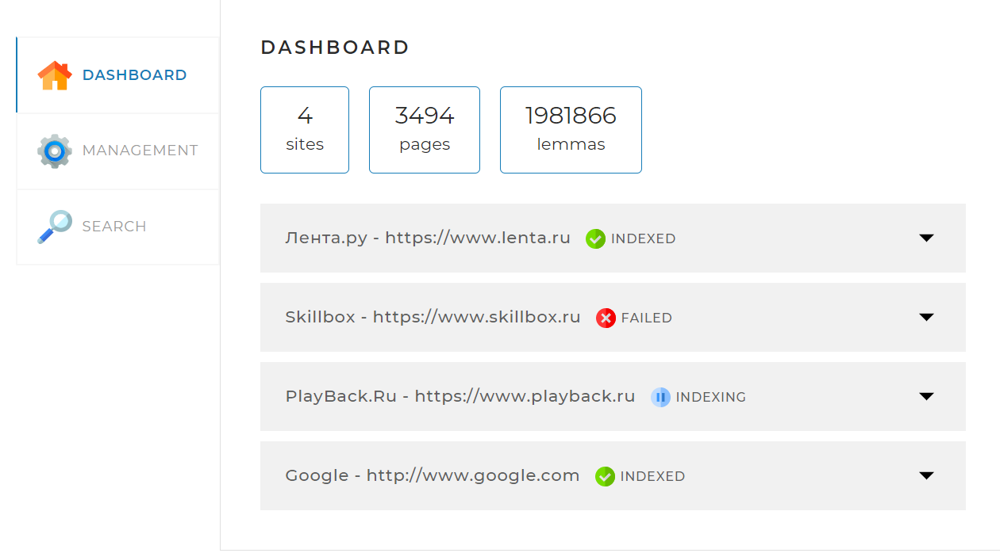
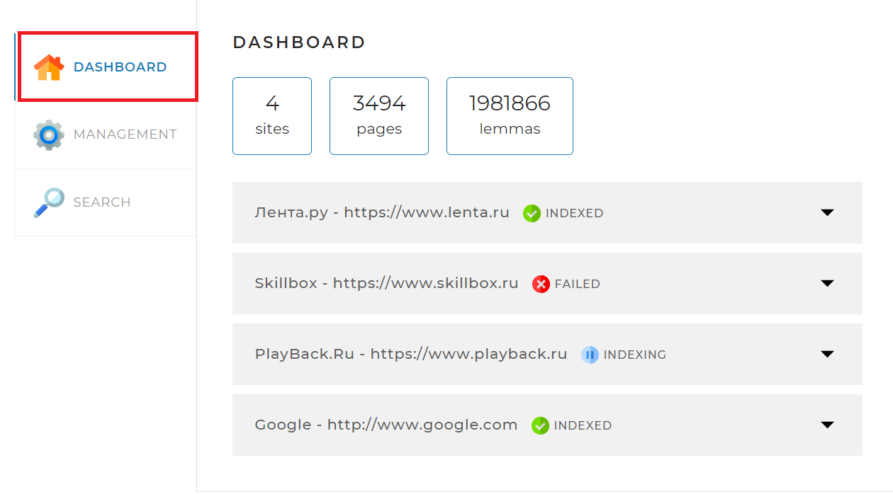
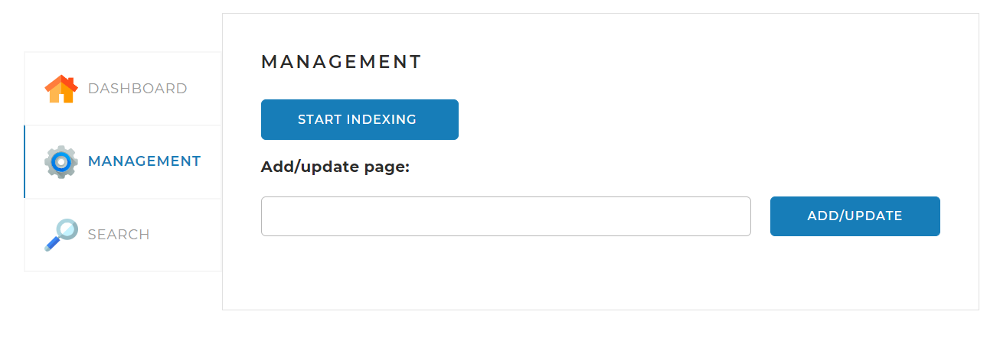
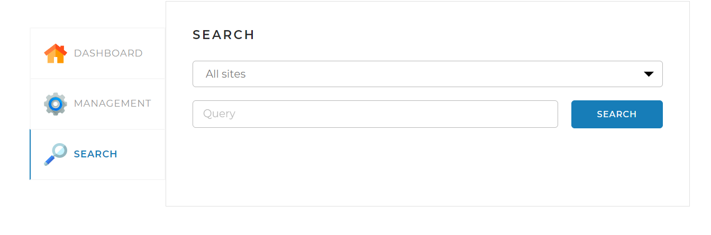
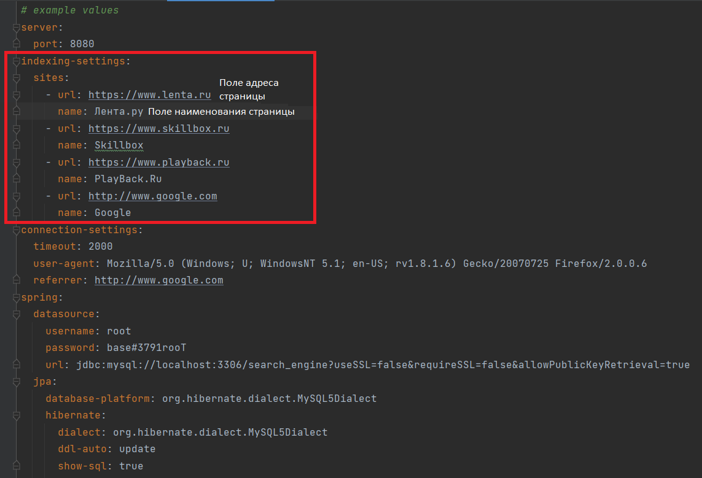

<!-- PROJECT LOGO -->
<br />
<div align="center">
  <a href="https://github.com/othneildrew/Best-README-Template">
    
  </a>

<h3 align="center">Поисковый движок "Ищейка"</h3>
</div>


<!-- Таблица контента -->
<details>
  <summary>Содержание</summary>
  <ol>
    <li>
      <a href="#О проекте">О проекте</a>
      <ul>
        <li><a href="###Ресурсы для создания проекта">Ресурсы для создания проекта</a></li>
      </ul>
    </li>
    <li>
      <a href="# Начало работы">Начало работы</a>
      <ul>
        <li><a href="#prerequisites">Предварительные условия</a></li>
        <li><a href="#installation">Установка</a></li>
      </ul>
    </li>
    <li>
<a href="#usage">Руководство пользователя</a>
      <ul>
        <li><a href="#prerequisites">Общие сведения</a></li>
        <li><a href="#prerequisites">Индексирование страниц</a></li>
        <li><a href="#prerequisites">Инструкция по заполнению конфигурационного файла application.yaml</a></li>
        <li><a href="#installation">Поиск</a></li>
      </ul>

</li>
  </ol>
</details>


<!-- О проекте -->

## О проекте

[](images/1.png)

Если вам нужна поисковая система и аналитическая СУБД,
то обязательно обратите внимание на поисковый движок "Ищейка".
"Ищейка" — это масштабируемая распределенная поисковая
система полнотекстового поиска и анализа данных
с веб-интерфейсом, REST API, которая разработана на базе
полнотекстового поиска Lucene и работает в режиме реального времени.

### Ресурсы для создания проекта

Основные ресурсы необходимые для загрузки проекта:

* 
* 
* 

<p align="right"><a href="#О проекте">к содержанию</a></p>

<!-- GETTING STARTED -->

## Начало работы

Для запуска локальной копии выполните шаги описанные ниже.

### Предварительные условия

Скачайте среду для запуска проекта [Intellij idea](https://www.jetbrains.com/ru-ru/idea/)

### Installation

Выполните следующие шаги по установке:

1. Перейдите по ссылке и скачайте проект [GitHub](https://github.com/beatleJK/Projects.git) с помощью команды
   ```sh
   git clone https://github.com/beatleJK/Projects.git
   ```
2. Установите пакет
   ```sh
   engine install
   ```

<p align="right">(<a href="#readme-top">back to top</a>)</p>


<!-- USAGE EXAMPLES -->

## Руководство пользователя

### Общие сведения



1. Dashboard отвечает за сбор статистики поискового движка
   и содержит информацию:

* О количестве проиндексированных сайтов
* Об общем количестве проиндексированных веб-страниц
* О количестве найденных лемм на этих страницах



2. Вкладка Management содержит инструменты управления поисковым движком.
   
3. SEARCH предназначена для поиска информации на индексированных страницах
   на основании введенного запроса.

### Индексирование страниц

* Внесите адрес и наименование страницы, которую
  намерены проиндексировать в конфигурационный файл application.yaml
  (папка resources).
* Запустите индексацию одной страницы или переиндексацию
  всех страниц указанных в конфигурационном файле(вкладка MANAGEMENT)

### Инструкция по заполнению конфигурационного файла application.yaml
Чтобы проиндексировать сайт, необходимо внести сведения о нем в конфигурационный файл (application.yaml)

* В поле url укажите адрес веб-страницы.
* В поле name укажите её наименование под которым она будет указана.

### Поиск
Для того, чтобы произвести поиск выполните следующие действия: 
1. Откройте вкладку SEARCH 
2. В выпадающем списке(All sites) выберете сайт по которому необходимо
произвести поиск(по умолчанию поиск производится по всем сайтам в индексе)
3. Введите поисковый запрос в форму поиска на странице
4. Нажмите на кнопку поиска
Вы получите список сайтов релевантных запросу.